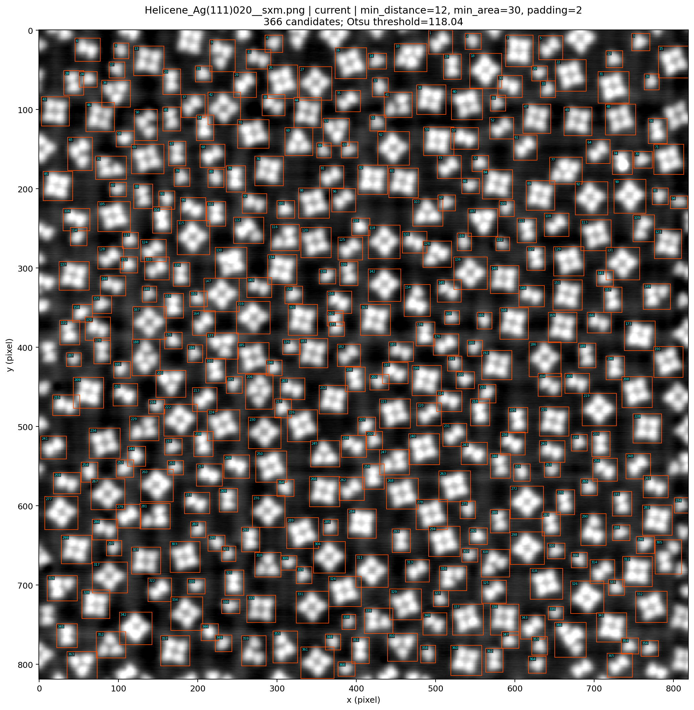
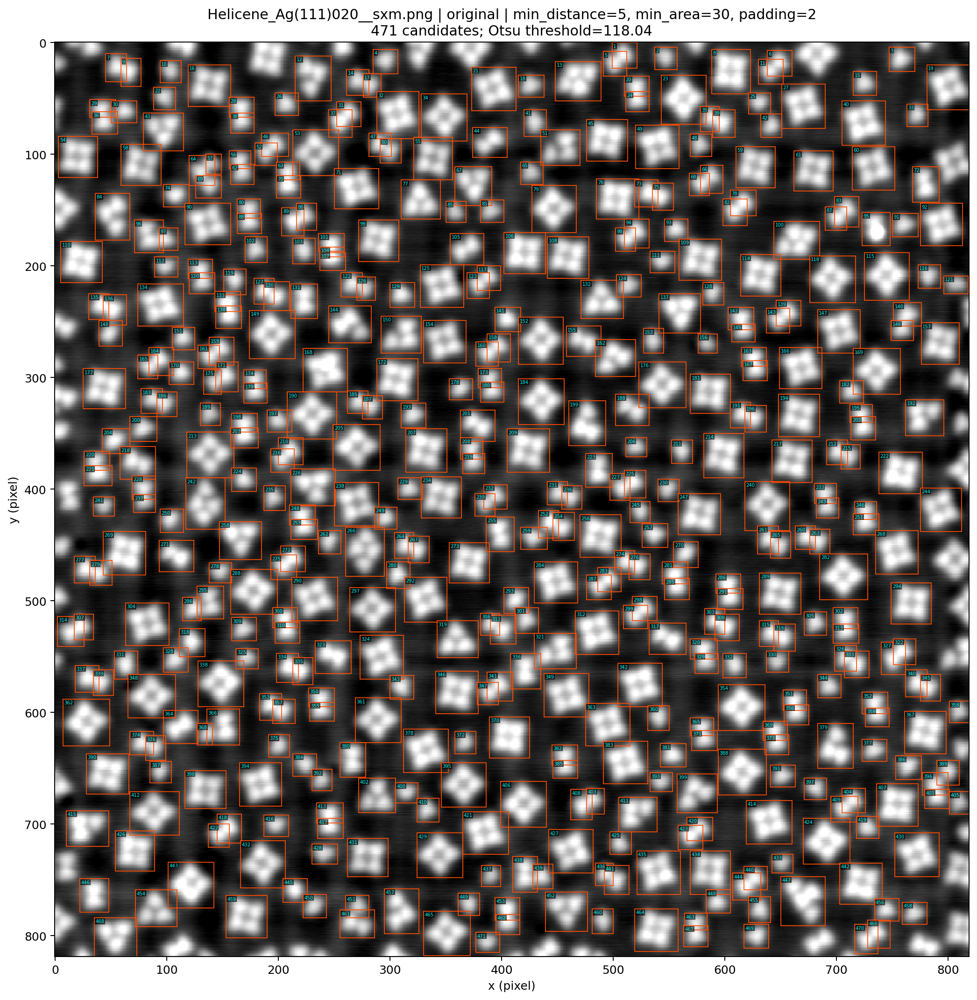
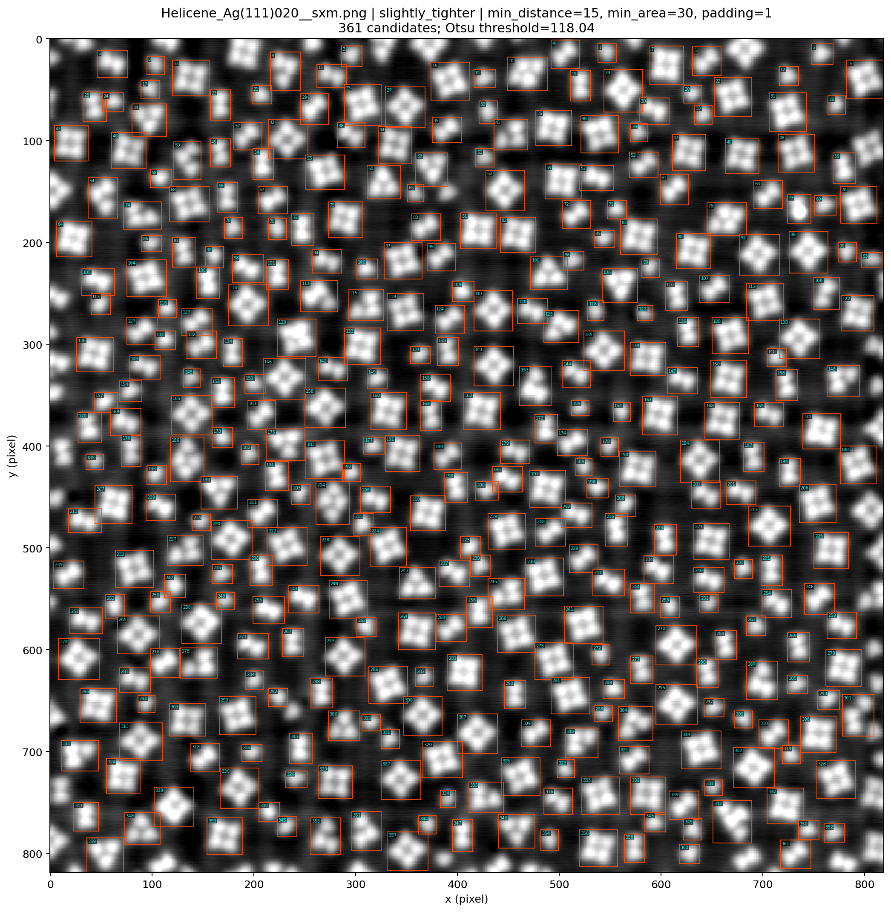
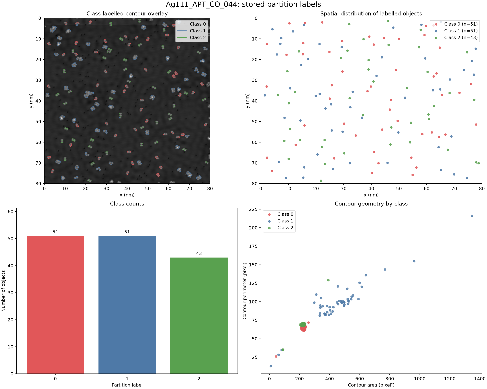
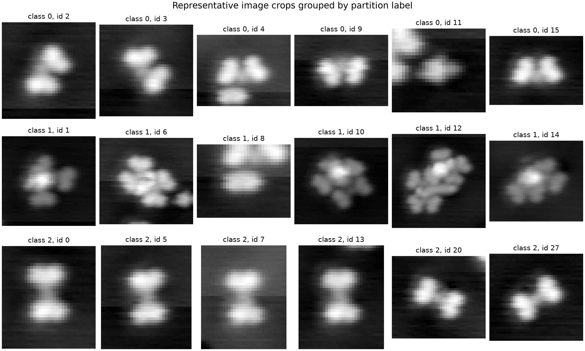

# STM Molecular Image Analysis and Classification

**Portfolio snapshot · Status: Ongoing**

This repository presents selected work from an ongoing group project using scanning tunnelling microscopy (STM) images to detect, crop, label, and classify molecular structures.

The repository is intended as a visual portfolio snapshot. The rendered notebook outputs and figures are included for review; the original STM data and full crop datasets are intentionally not included.

## Project workflow

```text
STM image
   ↓
Molecule detection and segmentation
   ↓
Image crops and manual labels
   ↓
Class-balanced CNN training
   ↓
Training curves and classification diagnostics
```

## Selected visual results

### Segmentation and molecule detection

The segmentation workflow identifies candidate molecular objects and produces image crops for later analysis. The examples below compare different parameter settings on a Helicene STM image.



| Original setting | Current setting | Tighter setting |
|---|---|---|
|  |  |  |

### Labelled objects and molecule crops

The project uses manually labelled molecular crops to inspect class structure and prepare a classification dataset.





## My contribution

My contribution focused on **molecule segmentation, manual labelling, and CNN-based classification**. This included:

- comparing segmentation parameters to improve molecule detection and reduce duplicate or unsuitable detections;
- generating and reviewing molecular image crops from segmented STM images;
- manually labelling molecular crops to prepare supervised classification data;
- creating a stratified training/validation split;
- applying grayscale normalisation and random rotation augmentation;
- using class-balanced sampling during training;
- defining and training a compact CNN in PyTorch; and
- reviewing training curves, confusion matrices, and rotation robustness.

For the Helicene STM image shown above, segmentation parameter refinement produced **366 candidate molecular crops**, which were subsequently reviewed and labelled for classification.

The notebook currently documents an experiment using **366 manually labelled crops across four classes**. These are interim project results rather than a final benchmark, as the project is still ongoing.

## Notebook

- [`cnn_molecule_classifier_Jiajie.ipynb`](notebooks/cnn_molecule_classifier_Jiajie.ipynb) — CNN classification workflow with rendered outputs.

The notebook is included primarily for inspection. Re-running it requires the original local data structure, manual labels, molecule crops, and the relevant Python/PyTorch environment.

## Project status

**Ongoing.** This repository represents the current stage of the project. Future work may include refining manual labels, comparing segmentation settings more systematically, improving the validation design, and evaluating the classifier on additional STM images.
